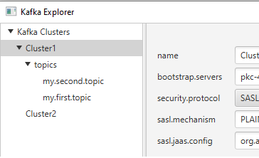
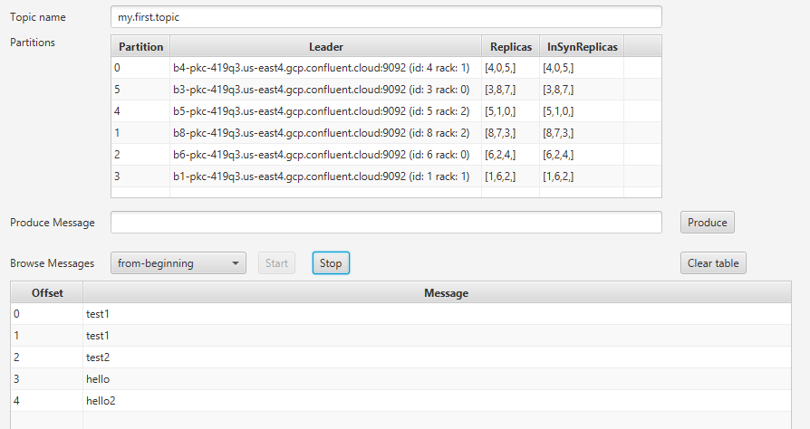

[](https://ko-fi.com/B0B132J1L)


# Kafkaexplorer  

An easy, straight to the point, **graphical tool** to explore Kafka topics and produce messages.
Working on **Windows, MacOs and Linux**.

 

Features:
- List Kafka topics
- Browse topics from the beginning (see offset, key, message content, partition)
- See partitions information for a topic (leader, replicas, inSynReplica)
- Produce String messages into topics
- Support protocol: SASL_SSL and mechanism: PLAIN

Coming soon Features:
- Support more security protocols like SSL (keystore authentication)
- Support Json and Avro message formats for consuming/producing messages
- Display consumer groups information (with last offset)
- Export topic messages to files
- Import messages from files to topics
- Access some Cluster/Topic metrics

## Requirements (config.yaml)

A config file with all the connection information to your kafka clusters must exist here:

| OS  | location  |
| --- | --- |
|Windows|%HOMEDRIVE%%HOMEPATH%/kafkaexplorer/config.yaml| 
|MacOs|~/kafkaexplorer/config.yaml| 
|Linux|~/kafkaexplorer/config.yaml| 

A sample config.yaml is provided [here](/config/config.yaml)

## How to run from binaries

Download the file **kafkaexplorer.jar** from the last release:
https://github.com/stephaneuh/kafkaexplorer/releases/latest

Simply execute:

```
java -jar kafkaexplorer-[RELEASE_NAME].jar
```

## How to build and run from sources

Simply execute:
```
mvn clean javafx:run
```
