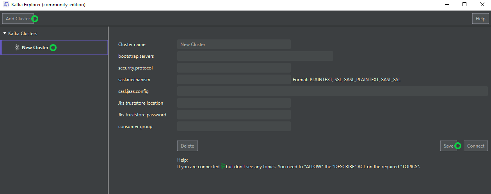

<p align="center">

<br />
<a href='https://ko-fi.com/B0B132J1L' target='_blank'></a>

</p>


# Kafkaexplorer (community-edition) 

An free, easy, straight to the point, **graphical tool** to explore Kafka topics and produce messages.
Working on **Windows** and **MacOs**. Based on [JavaFx](https://en.wikipedia.org/wiki/JavaFX).

## Screenshots 

 

## Features

- List Kafka topics
- Browse topics from the beginning (see offset, key, message content, partition)
- See partitions information for a topic (leader, replicas, inSynReplica)
- Produce String messages into topics
- Support protocol: SASL_SSL and mechanism: PLAIN
- JKS truststore support 

Coming soon Features:
- Support more security protocols like SSL (keystore authentication)
- Support Json and Avro message formats for consuming/producing messages
- Display consumer groups information (with last offset)
- Export topic messages to files
- Import messages from files to topics
- Access some Cluster/Topic metrics

Have questions? [Q&A section](https://github.com/stephaneuh/kafkaexplorer/discussions/categories/q-a).


## How to install

Download and install the latest version:

- Windows: [Kafkaexplorer_1.1.exe](/releases/Kafkaexplorer_1.1.exe)
- MacOs: [Kafkaexplorer_1.1.dmg](/releases/Kafkaexplorer_1.1.dmg)

## How to connect to a Kafka cluster

- Click on "Add Cluster"
- Select the "New Cluster" in the list
- Enter the connection information
- Save


## How to build/package/run from sources

Simply execute:

```
mvn javafx:run
```